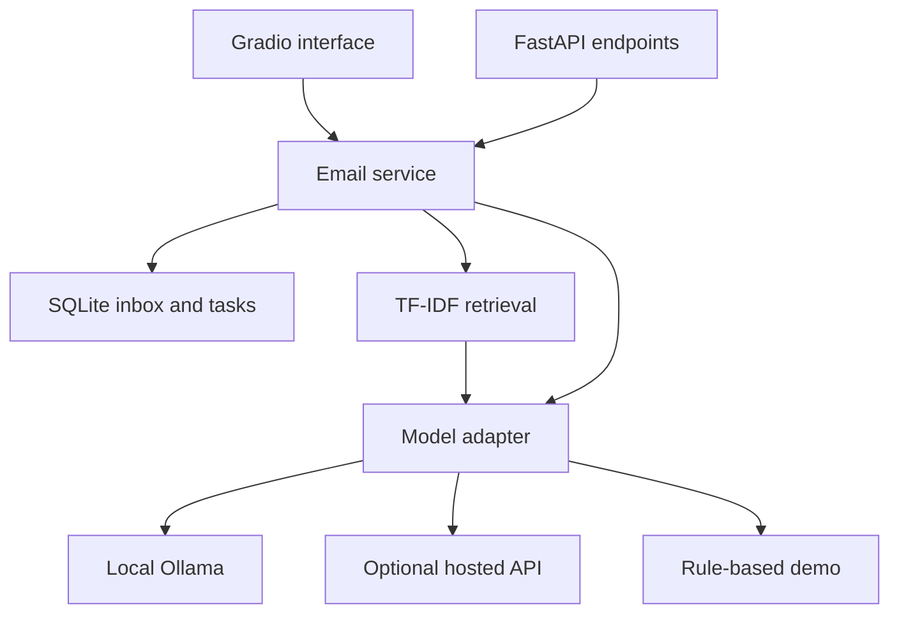

# InboxPilot — AI Email Assistant

A local, single-user capstone project built with FastAPI, Gradio, SQLite, and optional local or hosted LLMs.

## Problem statement
People spend significant time reading and organizing emails because important messages, requests, and follow-up actions can easily be missed.

## Project overview
InboxPilot imports email files, summarizes messages, flags priorities, extracts tasks with source quotes, answers questions using retrieved email excerpts, and prepares editable replies. Nothing is automatically sent.

### Three execution modes
| Mode | Requires | Behavior |
|---|---|---|
| `demo` (default) | Python dependencies | Offline keyword classification, extractive summaries, retrieval excerpts, template replies. **Not an LLM.** |
| `ollama` | Ollama + downloaded local model | Real local LLM analysis, retrieval-augmented answers, generated drafts; no API fee |
| `api` | Compatible provider key and model | Same interface with hosted inference; provider charges may apply |

Local mode is free of API charges, but needs hardware, electricity, and internet for initial package/model downloads. Once downloaded, the model can run locally. The API adapter requires a Chat Completions endpoint supporting `response_format: json_object`; it is not universal to all providers.

## Key features
- Import `.eml`, UTF-8 `.txt`, or JSON arrays of emails; synthetic sample inbox included.
- Duplicate detection, persistent SQLite inbox, priorities and categories.
- Structured task extraction with exact source-quote validation and verbatim deadline wording.
- Task completion tracking; identical tasks preserve status on re-analysis.
- TF-IDF retrieval across overlapping email chunks, with sources shown beside answers.
- Editable reply drafts and selectable tone.
- Input size limits, validated model responses, visible provider errors, no silent demo fallback.
- FastAPI endpoints and Swagger documentation.

## Technologies and architecture
Python 3.11 or 3.12, FastAPI, Gradio 5, Pydantic, SQLite, scikit-learn, HTTPX, Ollama or an optional compatible API.



`app/core.py` implements import, storage, extraction, retrieval, and providers. `app/main.py` exposes the UI and API. UI callbacks and API endpoints share the same service layer.

### Training concept mapping
LLMs and prompt engineering: structured extraction and grounded generation in Ollama/API modes. RAG: lexical retrieval followed by model generation. FastAPI and Gradio: backend and interface. This version uses a deterministic workflow, **not an autonomous tool-calling agent**. It does not implement multimodal attachment analysis or Nexus AI integration. Confirm whether these are mandatory with your instructor before submitting; the stated course platform is Nexus AI.

## Setup and installation — Windows PowerShell
Install Python 3.11 or 3.12, extract the ZIP, and open a terminal inside `inboxpilot`.

```powershell
py -3.12 -m venv .venv
.\.venv\Scripts\python.exe -m pip install -r requirements-lock.txt
Copy-Item .env.example .env
.\.venv\Scripts\python.exe -m uvicorn app.main:app --host 127.0.0.1 --port 8000
```

If you installed Python 3.11, replace `py -3.12` with `py -3.11`. These commands do not require changing PowerShell execution policy. After setup, `run.bat` also starts the app.

### macOS / Linux
```bash
python3 -m venv .venv
.venv/bin/python -m pip install -r requirements-lock.txt
cp .env.example .env
.venv/bin/python -m uvicorn app.main:app --host 127.0.0.1 --port 8000
```

Open **http://127.0.0.1:8000/ui/**. API documentation: **http://127.0.0.1:8000/docs**. Run commands from the project root. `requirements-lock.txt` pins the tested main dependencies; transitive dependencies are not fully locked. `requirements.txt` provides compatible version ranges.

## Enable real local AI
Install Ollama from https://ollama.com/download, then run:

```bash
ollama pull qwen2.5:3b
```

Edit `.env`:
```dotenv
AI_MODE=ollama
OLLAMA_URL=http://localhost:11434
OLLAMA_MODEL=qwen2.5:3b
```
Restart InboxPilot. Ollama must be running; if needed, run `ollama serve` in another terminal. Model downloads are several GB depending on model/quantization. A small model is a practical starting point; speed depends on available RAM, GPU, and context length. No model weights are bundled.

## Optional API-key version
The same code supports API mode; no second installation is needed. Edit `.env`:

```dotenv
AI_MODE=api
API_BASE_URL=https://YOUR-PROVIDER/v1
API_MODEL=YOUR-AVAILABLE-MODEL-ID
API_KEY=YOUR-KEY
```

Use your provider's documented base URL and model. Restart the application. This transmits the selected email or retrieved excerpts and question to the provider. Never put keys in source code, screenshots, or GitHub. `.env` is excluded by `.gitignore`.

## How to run the demo
1. Load the sample inbox and choose the urgent security review email.
2. Click **Analyze selected email**; inspect tasks and source quotes.
3. In **Ask your inbox**, ask “What does the security review require?”
4. Review retrieved sources. Demo mode returns excerpts; LLM modes synthesize an answer.
5. Mark a task completed in **Tasks**.
6. Prepare and edit a draft in **Reply drafts**.

JSON uploads use this format (maximum 50 emails per JSON file):
```json
[{"subject":"Project review","sender":"maya@example.test","date":"2026-10-06","body":"Please review the report by Friday."}]
```
EML attachments are ignored; the plain-text body is preferred, with HTML converted to plain text. Each body is limited to 30,000 characters. UI uploads allow 10 files per operation, with a 2 MB limit per file.

## Tests
```bash
python -m pip install -r requirements-dev.txt
python -m pytest -q
```
Tests cover duplicate imports, EML HTML handling, malformed/oversized uploads, persisted completion state, relevant/no-match retrieval, unsupported task evidence, provider request formats, and API workflow. Provider tests use mocks; live LLM quality must be evaluated with your installed model/key.

## Screenshots and demo video
See `docs/screenshots/` for any included execution screenshots and `docs/DEMO_SCRIPT.md` for a 3–4 minute recording plan.

**Demo video: pending your recording — add an accessible 2–5 minute video link here before submission.**

## GitHub submission
Create an empty **public** repository in your own GitHub account. Run these commands from the extracted project folder, replacing the URL:
```bash
git init
git add .
git commit -m "Build InboxPilot email assistant"
git branch -M main
git remote add origin https://github.com/YOUR-USERNAME/inboxpilot.git
git push -u origin main
```
Before pushing, review `git status` and make sure `.env`, local email data, and credentials are excluded. Add your team details, actual screenshots, and video link to this README. Verify the repository and video in a signed-out browser. Submit the repository URL in your team's Excel column. This package does not create or publish a GitHub repository for you.

## Limitations and responsible use
- Local single-user prototype without authentication; bind only to 127.0.0.1. No production/public hosting configuration is included.
- No Gmail/Outlook synchronization, sending, notifications, attachment OCR, or Nexus AI integration.
- Dates are preserved as written, not normalized or scheduled. Tasks/priorities may be wrong and require review.
- TF-IDF uses lexical similarity, so paraphrases can be missed. Sources are evidence for review, not a guarantee that every generated claim is correct.
- Email instructions are treated as untrusted data in prompts, but prompt injection is not fully solved. The model has no execution or email-sending tools.
- Model calls can take up to 180 seconds. Invalid output is rejected; try another model or retry.
- SQLite is unencrypted; use synthetic data for presentations. Clear workspace removes app rows but is not secure erasure of disk contents.
- Re-analysis regenerates tasks. Completion is preserved only for identical description/quote pairs.

## Reference documentation
- https://www.gradio.app/docs/gradio/mount_gradio_app
- https://docs.ollama.com/api/chat
